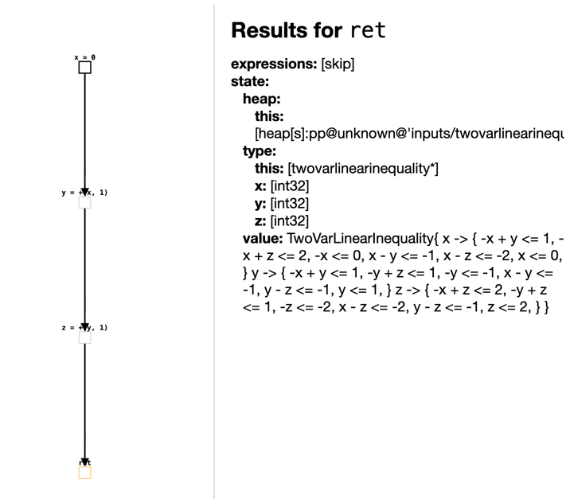
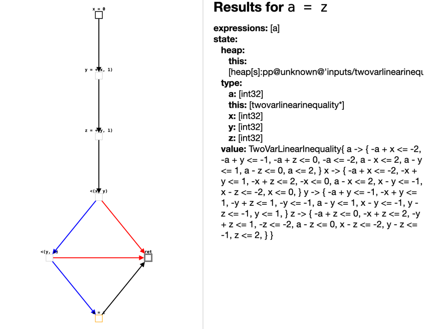
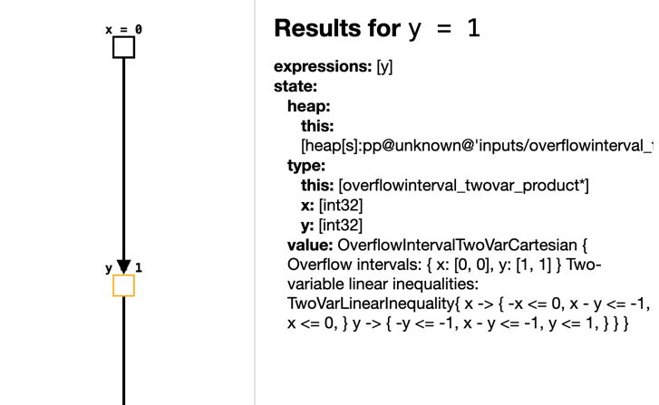
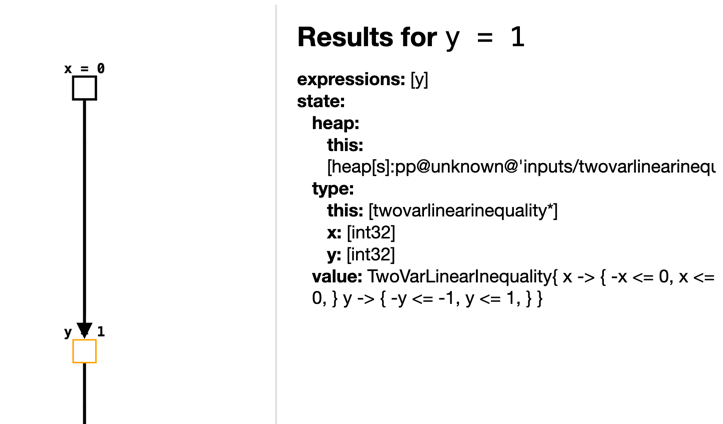
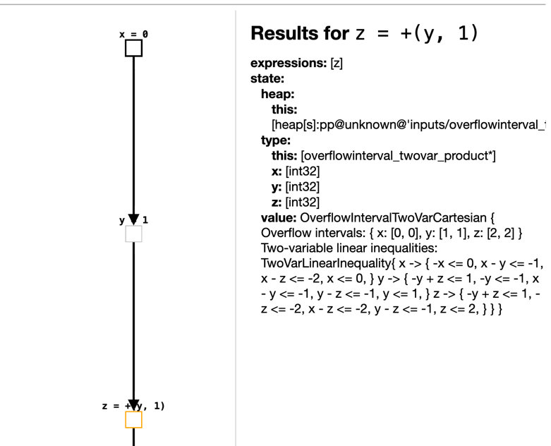
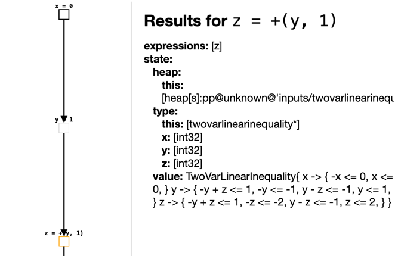

# TAS Project 2026

## Authors
- LI Mengxiao
- YANG Xue

## Implemented Domains
- `OverflowInterval` — Intervals taking into account overflows (non-relational domain, difficulty 4)
- `TwoVarLinearInequality` — Two variables per linear inequality (relational domain, difficulty 4)
- `OverflowIntervalTwoVarCartesian` — Cartesian product of the two domains above

---

## Domain 1: OverflowInterval — Intervals taking into account overflows

**Implementation file:** `src/main/java/it/unive/lisa/tutorial/OverflowInterval.java`  
**Test file:** `src/test/java/it/unive/lisa/tutorial/OverflowIntervalTest.java`  
**IMP program:** `inputs/overflow_interval.imp`

### Description

`OverflowInterval` is a non-relational abstract domain based on the standard interval domain (course section 4.5), extended to handle 32-bit signed integer overflow.

In the standard interval domain, variable values are represented as mathematical intervals `[low, high]` with bounds in `ℤ ∪ {-∞, +∞}`. This domain adapts that idea to machine arithmetic by restricting all bounds to the 32-bit signed integer range:

- `MIN = Integer.MIN_VALUE = -2147483648`
- `MAX = Integer.MAX_VALUE = 2147483647`

The key design decision is the **`normalize` function**: after every arithmetic operation, the result interval is checked against the machine range. If it fits within `[MIN, MAX]`, the precise interval is returned. If any bound exceeds the machine range, the result is conservatively approximated as `TOP = [MIN, MAX]`, meaning the value is unknown but still within the machine range.

This design is **sound**: the analysis never claims a value is in an interval when the concrete value might lie outside it. It is simpler than the wrapped-interval approach from the reference paper, but fully compatible with LiSA's `BaseNonRelationalValueDomain` structure.

### Lattice Structure

| Element | Representation | Meaning |
|---------|---------------|---------|
| `TOP`   | `[MIN, MAX]`  | Any 32-bit integer value |
| `BOTTOM`| `⊥`           | Unreachable state |
| `[a,b]` | `[a, b]`      | Variable is in the range `[a,b]` |

Lattice operations:

| Operation | Definition |
|-----------|-----------|
| `lessOrEqual(a, b)` | `b.low ≤ a.low` and `a.high ≤ b.high` (b contains a) |
| `lub(a, b)` | `normalize(min(a.low, b.low), max(a.high, b.high))` |
| `glb(a, b)` | `normalize(max(a.low, b.low), min(a.high, b.high))`, or `BOTTOM` if empty |
| `widening(a, b)` | Expands toward `MIN`/`MAX` instead of `±∞` to ensure termination |

### Abstract Semantics

**Constant evaluation:** An integer constant `c` evaluates to the singleton interval `[c, c]`.

**Unary negation:** `-[a, b]` is computed as `normalize(-b, -a)`. For example, `-[2, 5] = [-5, -2]`. Negating `MIN_VALUE` overflows and yields `TOP`.

**Binary arithmetic:**

| Operator | Formula | Overflow handling |
|----------|---------|-------------------|
| `[a,b] + [c,d]` | `normalize(a+c, b+d)` | `MAX+1` → `TOP` |
| `[a,b] - [c,d]` | `normalize(a-d, b-c)` | `0-MIN` → `TOP` |
| `[a,b] * [c,d]` | `normalize(min(ac,ad,bc,bd), max(ac,ad,bc,bd))` | `50000*50000` → `TOP` |
| `[a,b] / [c,d]` | Uses `IntInterval.div`; divisor `[0,0]` → `BOTTOM` | Sound division |

**Comparison satisfiability (`satisfiesBinaryExpression`):** Determines whether a binary comparison is `SATISFIED`, `NOT_SATISFIED`, or `UNKNOWN` by analysing interval overlap and bounds. For example, `[3,5] < [7,9]` is `SATISFIED` since no overlap and `5 < 7`.

**Branch refinement (`assumeBinaryExpression`):** When entering a conditional branch, the variable's interval is intersected with the range implied by the condition. For example, after `if (x < 10)`, the variable `x` is refined from `[MIN,MAX]` to `[MIN,9]`.

### Test Program and Analysis Results

The file `inputs/overflow_interval.imp` contains nine test functions covering normal arithmetic, overflow detection, division semantics, and branch refinement.

---

#### `basic()` — Precise arithmetic with no overflow

```java
basic() {
    def x = 5;     // x = [5,5]
    def y = -x;    // y = [-5,-5]
    def z = x + 2; // z = [7,7]
    return z;
}
```

All values stay within the machine range. The analysis is precise throughout: `x = [5,5]`, `y = [-5,-5]`, `z = [7,7]`.


---

#### `addOverflow()` — Addition overflow

```java
addOverflow() {
    def a = 2147483647;  // a = [MAX, MAX]
    def b = a + 1;       // MAX+1 overflows → b = TOP
    return b;
}
```

`2147483647 + 1` exceeds `MAX`. The `normalize` function detects this and returns `TOP = [MIN, MAX]`.


---

#### `negOverflow()` — Negation overflow at MIN_VALUE

```java
negOverflow() {
    def c = -2147483647;  // c = [-(MAX), -(MAX)]
    def m = c - 1;        // m = [MIN, MIN]  (precise, in range)
    def d = 0 - m;        // -MIN overflows → d = TOP
    return d;
}
```

`Integer.MIN_VALUE` itself is representable exactly as `[MIN, MIN]`, but negating it (`-MIN = MAX+1`) exceeds the machine range, so `d = TOP`.


---

#### `division()` — Precise integer division

```java
division() {
    def e = 0;
    def f = 5;
    def g = e / f;  // [0,0] / [5,5] = [0,0]
    return g;
}
```

The dividend is `[0,0]`, so the result is precisely `[0,0]`. No overflow occurs.


---

#### `divByZero()` — Division by zero yields BOTTOM

```java
divByZero() {
    def x = 5;
    def y = 0;
    def z = x / y;  // divisor = [0,0] → BOTTOM
    return z;
}
```

When the divisor is precisely `[0,0]`, the domain returns `BOTTOM`, marking this execution path as unreachable — the analysis detects a potential division-by-zero error.


---

#### `mulOverflow()` — Multiplication overflow

```java
mulOverflow() {
    def x = 50000;
    def y = 50000;
    def z = x * y;  // 2.5×10^9 > MAX → z = TOP
    return z;
}
```

`50000 × 50000 = 2,500,000,000`, which exceeds `MAX = 2,147,483,647`. The four-corner product check detects this and `normalize` returns `TOP`.


---

#### `branches()` — Precise branch analysis

```java
branches() {
    def x = 5;
    def y = 7;
    def z = 0;
    if (x < y) z = x + 1;  // taken: z = [6,6]
    else        z = y + 1;  // unreachable
    return z;
}
```

`satisfiesBinaryExpression` determines that `[5,5] < [7,7]` is `SATISFIED`, so the else branch is recognised as unreachable. The final result is precisely `z = [6,6]`.


---

#### `refine(a)` — Single branch refinement

```java
refine(a) {
    def x = a;          // x = TOP
    def y = 0;
    if (x < 10)
        y = x + 1;      // then: x in [MIN,9], y in [MIN+1,10]
    else
        y = x - 1;      // else: x in [10,MAX], y in [9,MAX-1]
    return y;           // lub: y = [MIN+1, MAX-1]
}
```

After merging both branches via `lub`, `y = [-2147483647, 2147483646]`. This is the exact join of `[MIN+1, 10]` and `[9, MAX-1]`, confirming that branch refinement and `lub` work correctly together.


---

#### `refineRange(a)` — Nested branch refinement

```java
refineRange(a) {
    def x = a;          // x = TOP
    def y = 0;
    if (x < 10)         // x refined to [MIN, 9]
        if (x > 0)      // x further refined to [1, 9]
            y = x + 1;  // y = [2, 10]
    return y;
}
```

`assumeBinaryExpression` successively narrows `x`:
- After `x < 10`: `x ∩ [MIN, 9] = [MIN, 9]`
- After `x > 0`: `x ∩ [1, MAX] = [1, 9]`
- Result inside the inner branch: `y = [1,9] + [1,1] = [2,10]`

This is the key demonstration that the domain correctly tracks value ranges through nested conditionals.


### Limitations

- **Overflow loses all precision**: any operation that exceeds the 32-bit range returns `TOP` rather than a wrapped interval. This is sound but may be less precise than a wrapped-interval approach.
- **No relational information**: as a non-relational domain, it cannot represent relationships between variables (e.g., `x < y`).
- **Widening to bounds**: the widening operator jumps directly to `MIN`/`MAX`, which is sound but may cause fast precision loss in loop analysis.


---
## Domain 2: TwoVarLinearInequality

**Implementation file:** `src/main/java/it/unive/lisa/tutorial/TwoVarLinearInequality.java`  
**Test file:** `src/test/java/it/unive/lisa/tutorial/TwoVarLinearInequalityTest.java`  
**IMP program:** `inputs/twovarlinearinequality.imp`

---
### Description

Ce domaine est un **domaine abstrait relationnel**, conçu pour représenter des inégalités linéaires impliquant deux variables.  
Il permet d’exprimer des contraintes de la forme **a·x + b·y ≤ c**, afin de capturer les relations linéaires entre variables.

Contrairement aux domaines non relationnels, ce domaine est capable de suivre simultanément les relations entre plusieurs variables.  
Lors de l’analyse des programmes, il permet de déduire de nouvelles contraintes, de simplifier les relations existantes, et de propager ces informations à travers les différents chemins d’exécution, contribuant ainsi à une analyse statique plus précise.

---

### Représentation concrète dans l’implémentation

Dans l’implémentation, l’état abstrait est représenté par un **ensemble d’inégalités (Set of Inequalities)**.  
Chaque contrainte est de la forme **a·x + b·y ≤ c**, où :
- x et y sont des variables (`Identifier`),
- a et b sont des coefficients entiers,
- c est une constante.

Chaque inégalité est modélisée par une instance de la classe `Inequality`, qui encapsule ces éléments et fournit des opérations auxiliaires telles que la normalisation et la comparaison (entailment).

---

### Lattice structure

Dans ce domaine, nous définissons les opérations de base du treillis, incluant Top, Bottom, la relation d’ordre partiel ainsi que l’opérateur de jointure (lub).

#### Top et Bottom

- **Top** représente l’absence totale d’information, c’est-à-dire qu’aucune relation entre les variables n’est connue. Dans l’implémentation, Top est représenté par un ensemble vide d’inégalités.

- **Bottom** représente un état incohérent (insatisfiable), où les contraintes sont contradictoires. Dans l’implémentation, il est représenté par une inégalité impossible (par exemple 0 ≤ -1).


#### Relation d’ordre partiel (lessOrEqual)

La relation d’ordre est définie à partir de la notion d’implication entre ensembles de contraintes.

Dans l’implémentation, nous calculons d’abord la closure des deux ensembles d’inégalités. Ensuite, nous vérifions que chaque contrainte de l’état cible est impliquée par au moins une contrainte de l’état courant.

Si toutes les contraintes du second état sont impliquées, alors le premier état est considéré comme inférieur ou égal au second.


#### Jointure (lub)

L’opérateur de jointure permet de fusionner deux états abstraits.

Dans l’implémentation, lorsque deux inégalités possèdent la même partie gauche (mêmes variables et coefficients), nous conservons la contrainte la plus faible, c’est-à-dire celle ayant la constante la plus grande.

L’ensemble résultant est ensuite fermé à l’aide de l’opération de closure afin de dériver toutes les contraintes implicites.

---

### Abstract semantics

Ce domaine définit la sémantique abstraite des affectations (`assign`) et des conditions (`assume`), permettant de mettre à jour l’ensemble des inégalités afin de refléter les relations entre variables au cours de l’exécution du programme.

### Affectation (assign)

Lors du traitement d’une affectation, toutes les contraintes impliquant la variable assignée sont d’abord supprimées (opération de *forget*), car elles ne sont plus valides après l’affectation.  
Ensuite, de nouvelles contraintes sont ajoutées en fonction de la forme de l’expression.

L’implémentation actuelle supporte les cas suivants :

- Affectation par constante :  
  `x = c`  
  est traduite en :  
  `x ≤ c` et `-x ≤ -c`

- Affectation par variable :  
  `x = y`  
  est traduite en :  
  `x - y ≤ 0` et `y - x ≤ 0`

- Addition et soustraction :  
  `x = y + c` ou `x = y - c`  
  sont traduites en inégalités correspondantes, par exemple :  
  `x - y ≤ c` et `y - x ≤ -c`

- Formes avec multiplication :  
  `x = a*y`、`x = a*y + c`、`x = a*y - c`  
  sont transformées en contraintes linéaires équivalentes.

Après l’ajout des nouvelles contraintes, une opération de closure est appliquée afin de déduire les relations implicites et de maintenir la cohérence de l’état.


#### Conditions (assume)

Lors du traitement des conditions, les expressions de comparaison sont converties en inégalités, puis ajoutées à l’état courant.

Les formes supportées sont :

- Comparaisons entre variables :  
  `x ≤ y`、`x < y`、`x ≥ y`、`x > y`、`x == y`

- Comparaisons entre variable et constante :  
  `x ≤ c`、`x < c`、`x ≥ c`、`x > c`、`x == c`

Les inégalités strictes sont transformées en inégalités larges sous sémantique entière, par exemple :

- `x < y` devient `x - y ≤ -1`
- `x > y` devient `y - x ≤ -1`

Après l’ajout des contraintes, une closure est également appliquée pour enrichir l’ensemble des relations.


#### Vérification de satisfiabilité (satisfies)

La méthode `satisfies` permet de déterminer si une condition est toujours vraie, toujours fausse, ou indéterminée dans l’état courant.

Cette décision repose sur les contraintes présentes :

- Si l’état implique directement la condition, elle est considérée comme satisfaite (`SATISFIED`)
- Si l’état implique une contradiction avec la condition, elle est considérée comme non satisfaite (`NOT_SATISFIED`)
- Sinon, le résultat est `UNKNOWN`

Cette fonctionnalité est utilisée pour analyser la faisabilité des branches conditionnelles.

---

### Normalisation des inégalités

Dans notre implémentation, les contraintes sont normalisées afin d’obtenir une représentation canonique. Cette étape est essentielle pour faciliter la comparaison des contraintes, la suppression des doublons et l’identification des contraintes redondantes.

La normalisation repose sur deux principes principaux :

- une réduction des coefficients et de la constante par leur plus grand commun diviseur (gcd), afin de simplifier l’inégalité ;
- une mise en ordre déterministe des variables lorsque deux variables apparaissent dans la contrainte, de manière à éviter que deux contraintes équivalentes soient représentées sous des formes différentes.

Par exemple, les contraintes `x + y ≤ 5` et `y + x ≤ 5` sont transformées en une représentation unique, ce qui permet de garantir la cohérence de l’ensemble des inégalités.


### Closure
Dans le domaine TwoVarLinearInequality, après normalisation des contraintes, l’opération de closure permet d’enrichir l’ensemble des contraintes en déduisant des relations implicites entre variables.
Par exemple :

- x - y ≤ 2
- y - z ≤ 3

permettent de déduire :

- x - z ≤ 5

L’idée principale repose sur l’élimination de variables.

Si deux inégalités partagent une variable avec des coefficients de signes opposés, il est possible de les combiner afin d’éliminer cette variable et de produire une nouvelle contrainte.

Par exemple :

- a x + b y ≤ c
- d x + e y ≤ f

Si a > 0 et d < 0, on peut éliminer la variable x et obtenir une nouvelle inégalité.

#### Implémentation

L’opération de closure est réalisée en plusieurs étapes :

##### 1. Combinaison des inégalités (result)

Toutes les paires d’inégalités sont examinées.  
Si elles partagent des variables compatibles et permettent une élimination, une nouvelle inégalité est générée.

##### 2. Union des contraintes

Les nouvelles inégalités sont ajoutées à l’ensemble courant :

- current = current ∪ result(current)

##### 3. Filtrage (filter)

Certaines contraintes sont éliminées :

- contraintes triviales
- contraintes contradictoires (par exemple : 0x + 0y ≤ -1)

Si une contradiction est détectée, l’état correspond à Bottom.

##### 4. Itération contrôlée

La closure est appliquée de manière itérative, avec un nombre limité d’itérations afin d’éviter une explosion du nombre de contraintes.

Dans notre implémentation, le nombre d’itérations est proportionnel à log2(n - 1), où n est le nombre de variables.

---
### Test : 

#### Assignations de base

Ce test a pour objectif de vérifier le bon fonctionnement de l’opération d’assignation (assign) dans le domaine TwoVarLinearInequality.

Le programme contient une suite d’assignations simples :

```java
basic() {
  def x = 0;
  def y = x + 1;
  def z = y + 1;
}
```

Ces instructions permettent de construire progressivement des relations linéaires entre les variables.


La figure montre l’état abstrait obtenu à la fin de l’analyse. On peut observer que les relations suivantes sont correctement déduites :

- x ≤ 0 et -x ≤ 0
- y - x ≤ 1
- z - y ≤ 1

De plus, grâce à l’opération de closure, certaines relations implicites peuvent également être déduites, par exemple :

- x - z ≤ -2
- z ≤ 2

#### Conditions et inférence par closure

Ce test a pour objectif de vérifier le bon fonctionnement du traitement des `assume` ainsi que de l’opération de `closure`.

Le programme étend le cas des assignations simples en introduisant des conditions imbriquées :
```java
closure_test() {
  def x = 0;
  def y = x + 1;
  def z = y + 1;

  if (x < y) {
    if (y < z) {
      def a = z;
    }
  }
}
```

Ces conditions introduisent progressivement des relations d’ordre entre les variables, permettant de construire des contraintes plus riches.

La figure ci-dessous montre l’état abstrait à l’intérieur des conditions imbriquées (lorsque les deux conditions sont satisfaites) :


À ce point du programme, on a :

- x < y
- y < z

On peut observer que ces conditions sont correctement traduites en contraintes linéaires, par exemple :

- x - y ≤ -1
- y - z ≤ -1

De plus, grâce à l’opération de closure, le domaine est capable de déduire des relations implicites, par exemple :

- x - z ≤ -2

Cela montre que le domaine ne se limite pas à représenter des contraintes, mais qu’il est également capable de les combiner afin d’effectuer des inférences relationnelles, améliorant ainsi la précision de l’analyse statique.

---

## Product

Dans ce projet, nous avons construit un domaine produit en combinant **OverflowInterval** et **TwoVarLinearInequality** à l’aide de **CartesianProduct**.

Ce domaine produit permet de conserver simultanément deux types d’informations :

- **OverflowInterval** : permet de représenter les intervalles de valeurs des variables
- **TwoVarLinearInequality** : permet de capturer les contraintes linéaires entre variables

Grâce à cette combinaison, l’analyse peut à la fois refléter les bornes numériques des variables et exprimer les dépendances entre elles, ce qui améliore la précision globale de l’analyse.

En outre, nous avons introduit un mécanisme de réduction  au sein du produit, permettant une interaction entre les deux domaines.

Plus précisément :
  - le domaine des intervalles peut déduire des relations entre variables à partir des bornes numériques et les transmettre au domaine relationnel
  - inversement, les contraintes du domaine relationnel (par exemple des bornes supérieures ou inférieures) peuvent raffiner les intervalles

---

### Test :

Afin de mettre en évidence l’effet de la réduction du produit cartésien sur l’amélioration conjointe des deux domaines, nous avons conçu le programme de test suivant :
```java
reduction_relation() {
  def x = 0;
  def y = 1;
  def z = y + 1;
}
```
L’objectif de ce test est d’observer, à différents points du programme, si la réduction permet de déduire des relations supplémentaires entre variables à partir du domaine des intervalles.

#### 1. Analyse au point def y = 1;
Nous comparons ici :
  - le domaine relationnel seul(à droite)
 - le domaine produit avec reduction(à gauche)

<p align="center">
  
  
</p>
On peut observer par comparaison :

- Lorsqu'on utilise uniquement le domaine relationnel, on ne peut obtenir que des contraintes univariées sur les variables, par exemple `x = 0` et `y = 1`.

- En introduisant la réduction, le domaine des intervalles fournit des informations précises sur les valeurs possibles (`x ∈ [0,0]`, `y ∈ [1,1]`), ce qui permet de déduire des relations supplémentaires :
  - x - y <= -1

Cela montre que la réduction permet de transformer les informations d'intervalle en relations entre variables, renforçant ainsi l'expressivité du domaine relationnel.


#### 2. Analyse au point def z = y + 1;

<p align="center">
  
  
</p>

Nous comparons ici :
  - le domaine relationnel seul(à droite)
 - le domaine produit avec reduction(à gauche)

On peut observer par comparaison :

- Sans réduction, le domaine relationnel enregistre principalement les relations issues directement des affectations, par exemple `y < z`.

- Après l’introduction de la réduction, puisque l’on a déjà déduit `x < y`, en combinant avec la nouvelle relation `y < z`, on peut, via la closure, déduire :
  - x - z <= -2

Cela montre que les relations supplémentaires fournies par la réduction renforcent la capacité d’inférence de la closure, permettant ainsi de déduire davantage de contraintes implicites.

À travers ce test, on peut observer que :

- La réduction (*reduction*) permet de déduire de nouvelles relations entre variables à partir des informations d’intervalle, renforçant ainsi l’expressivité du domaine relationnel.

- Dans les analyses ultérieures, ces nouvelles relations peuvent être utilisées pour enrichir le raisonnement, améliorant ainsi l’efficacité de la fermeture (*closure*).

- Par conséquent, le domaine produit avec réduction offre une précision d’analyse plus élevée que le domaine relationnel seul.

---