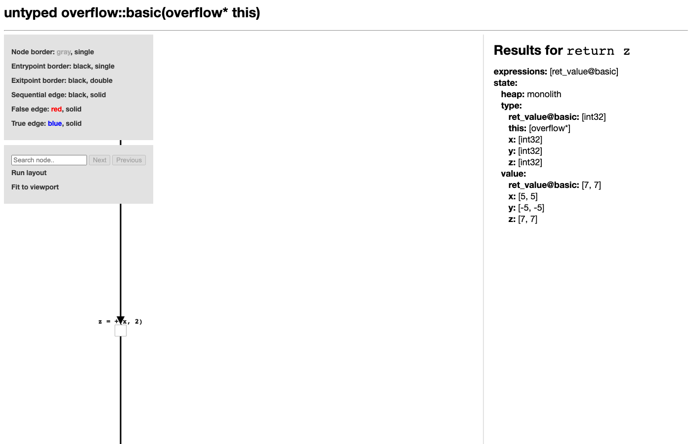
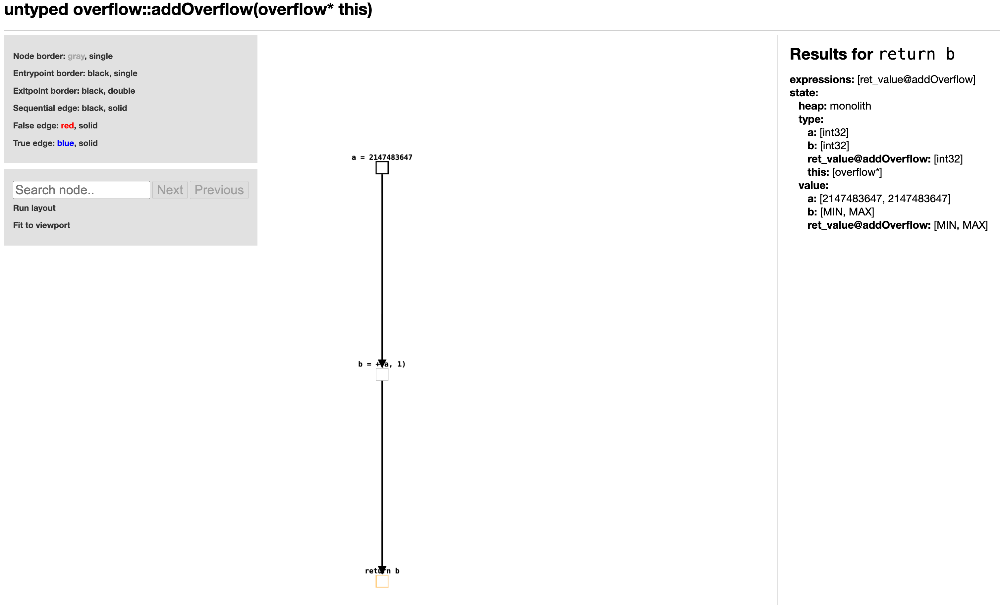
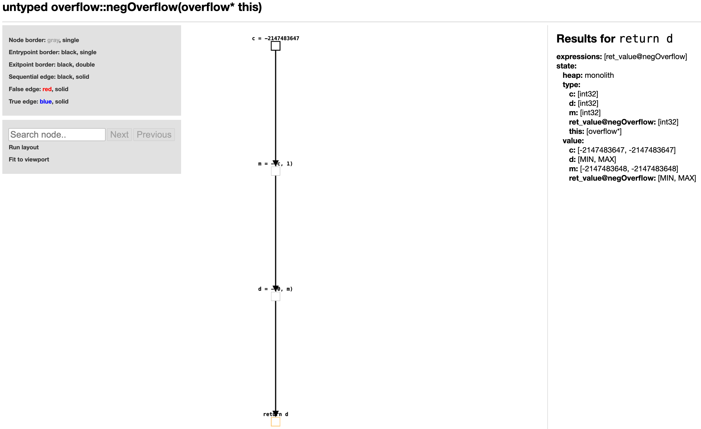
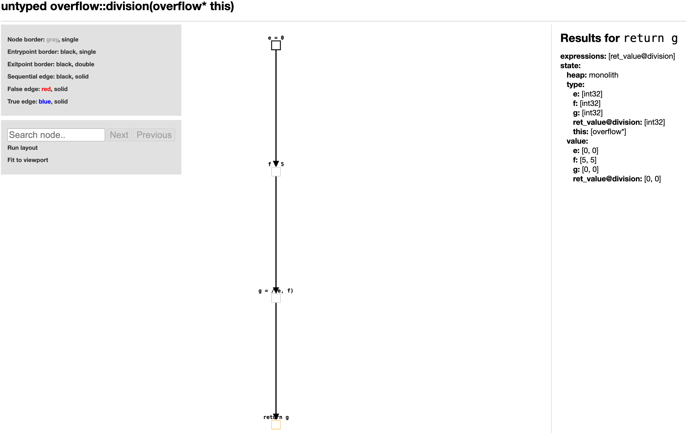
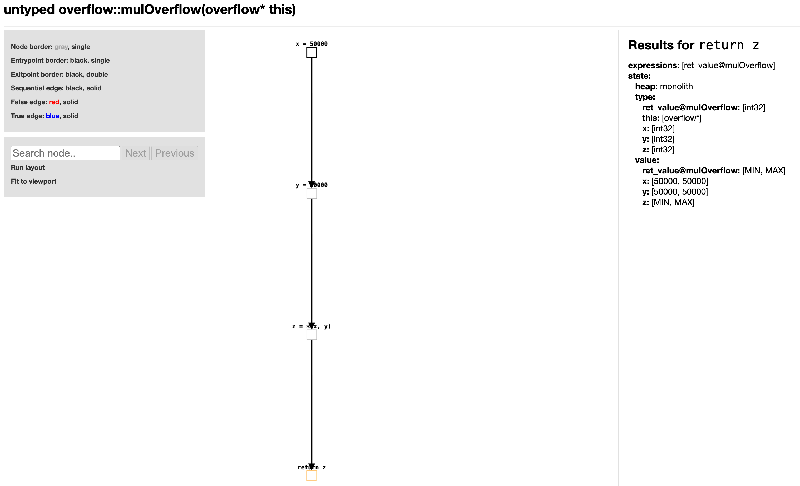
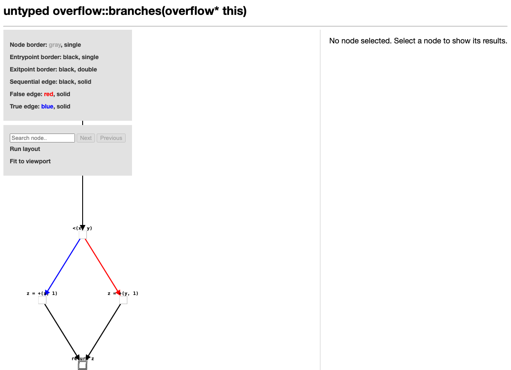
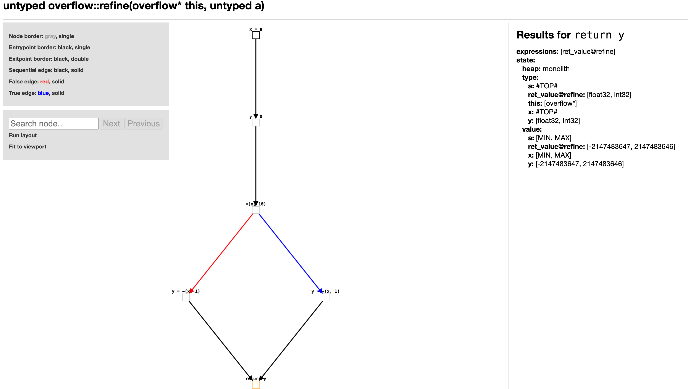
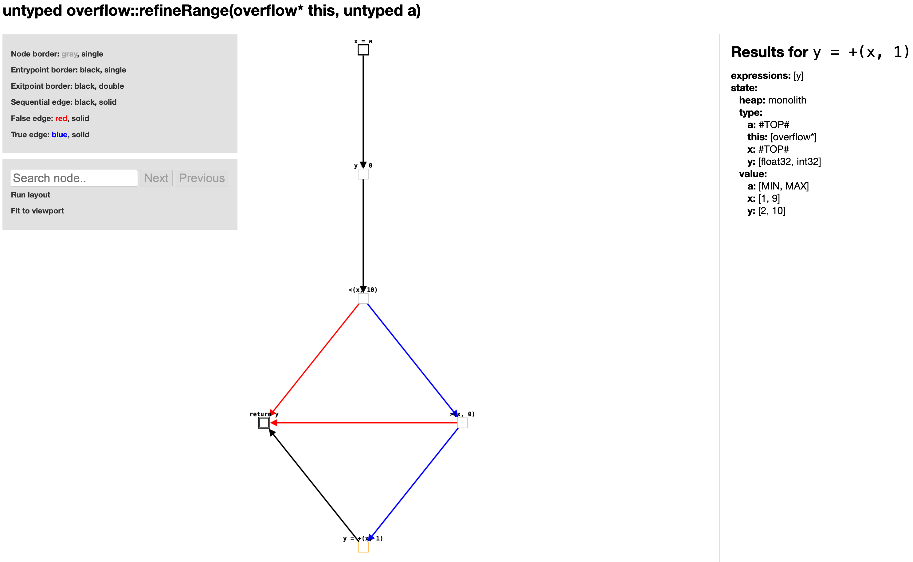

# TAS Project 2026

## Authors
- LI Mengxiao
- YANG Xue

## Implemented Domains
- `OverflowInterval` (non-relational domain, difficulty 4)
- `TwoVarLinearInequality` (relational domain, difficulty 4)
- `OverflowIntervalTwoVarCartesian` (Cartesian product)

---

## Domain 1: OverflowInterval

**Implementation file:** `src/main/java/it/unive/lisa/tutorial/OverflowInterval.java`  
**Test file:** `src/test/java/it/unive/lisa/tutorial/OverflowIntervalTest.java`  
**IMP program:** `inputs/overflow_interval.imp`

### Description

`OverflowInterval` is a non-relational abstract domain based on the standard interval domain (course section 4.5), extended to handle 32-bit signed integer overflow.

In the standard interval domain, variable values are represented as mathematical intervals `[low, high]` with bounds in `ℤ ∪ {-∞, +∞}`. This domain adapts that idea to machine arithmetic by restricting all bounds to the 32-bit signed integer range:

- `MIN = Integer.MIN_VALUE = -2147483648`
- `MAX = Integer.MAX_VALUE = 2147483647`

The key design decision is the **`normalize` function**: after every arithmetic operation, the result interval is checked against the machine range. If it fits within `[MIN, MAX]`, the precise interval is returned. If any bound exceeds the machine range, the result is conservatively approximated as `TOP = [MIN, MAX]`, meaning the value is unknown but still within the machine range.

This design is **sound**: the analysis never claims a value is in an interval when the concrete value might lie outside it. It is simpler than the wrapped-interval approach from the reference paper, but fully compatible with LiSA's `BaseNonRelationalValueDomain` structure.

### Lattice Structure

| Element | Representation | Meaning |
|---------|---------------|---------|
| `TOP`   | `[MIN, MAX]`  | Any 32-bit integer value |
| `BOTTOM`| `⊥`           | Unreachable state |
| `[a,b]` | `[a, b]`      | Variable is in the range `[a,b]` |

Lattice operations:

| Operation | Definition |
|-----------|-----------|
| `lessOrEqual(a, b)` | `b.low ≤ a.low` and `a.high ≤ b.high` (b contains a) |
| `lub(a, b)` | `normalize(min(a.low, b.low), max(a.high, b.high))` |
| `glb(a, b)` | `normalize(max(a.low, b.low), min(a.high, b.high))`, or `BOTTOM` if empty |
| `widening(a, b)` | Expands toward `MIN`/`MAX` instead of `±∞` to ensure termination |

### Abstract Semantics

**Constant evaluation:** An integer constant `c` evaluates to the singleton interval `[c, c]`.

**Unary negation:** `-[a, b]` is computed as `normalize(-b, -a)`. For example, `-[2, 5] = [-5, -2]`. Negating `MIN_VALUE` overflows and yields `TOP`.

**Binary arithmetic:**

| Operator | Formula | Overflow handling |
|----------|---------|-------------------|
| `[a,b] + [c,d]` | `normalize(a+c, b+d)` | `MAX+1` → `TOP` |
| `[a,b] - [c,d]` | `normalize(a-d, b-c)` | `0-MIN` → `TOP` |
| `[a,b] * [c,d]` | `normalize(min(ac,ad,bc,bd), max(ac,ad,bc,bd))` | `50000*50000` → `TOP` |
| `[a,b] / [c,d]` | Uses `IntInterval.div`; divisor `[0,0]` → `BOTTOM` | Sound division |

**Comparison satisfiability (`satisfiesBinaryExpression`):** Determines whether a binary comparison is `SATISFIED`, `NOT_SATISFIED`, or `UNKNOWN` by analysing interval overlap and bounds. For example, `[3,5] < [7,9]` is `SATISFIED` since no overlap and `5 < 7`.

**Branch refinement (`assumeBinaryExpression`):** When entering a conditional branch, the variable's interval is intersected with the range implied by the condition. For example, after `if (x < 10)`, the variable `x` is refined from `[MIN,MAX]` to `[MIN,9]`.

### Test Program and Analysis Results

The file `inputs/overflow_interval.imp` contains nine test functions covering normal arithmetic, overflow detection, division semantics, and branch refinement.

---

#### `basic()` — Precise arithmetic with no overflow

```java
basic() {
    def x = 5;     // x = [5,5]
    def y = -x;    // y = [-5,-5]
    def z = x + 2; // z = [7,7]
    return z;
}
```

All values stay within the machine range. The analysis is precise throughout: `x = [5,5]`, `y = [-5,-5]`, `z = [7,7]`.



---

#### `addOverflow()` — Addition overflow

```java
addOverflow() {
    def a = 2147483647;  // a = [MAX, MAX]
    def b = a + 1;       // MAX+1 overflows → b = TOP
    return b;
}
```

`2147483647 + 1` exceeds `MAX`. The `normalize` function detects this and returns `TOP = [MIN, MAX]`.



---

#### `negOverflow()` — Negation overflow at MIN_VALUE

```java
negOverflow() {
    def c = -2147483647;  // c = [-(MAX), -(MAX)]
    def m = c - 1;        // m = [MIN, MIN]  (precise, in range)
    def d = 0 - m;        // -MIN overflows → d = TOP
    return d;
}
```

`Integer.MIN_VALUE` itself is representable exactly as `[MIN, MIN]`, but negating it (`-MIN = MAX+1`) exceeds the machine range, so `d = TOP`.



---

#### `division()` — Precise integer division

```java
division() {
    def e = 0;
    def f = 5;
    def g = e / f;  // [0,0] / [5,5] = [0,0]
    return g;
}
```

The dividend is `[0,0]`, so the result is precisely `[0,0]`. No overflow occurs.



---

#### `divByZero()` — Division by zero yields BOTTOM

```java
divByZero() {
    def x = 5;
    def y = 0;
    def z = x / y;  // divisor = [0,0] → BOTTOM
    return z;
}
```

When the divisor is precisely `[0,0]`, the domain returns `BOTTOM`, marking this execution path as unreachable — the analysis detects a potential division-by-zero error.


---

#### `mulOverflow()` — Multiplication overflow

```java
mulOverflow() {
    def x = 50000;
    def y = 50000;
    def z = x * y;  // 2.5×10^9 > MAX → z = TOP
    return z;
}
```

`50000 × 50000 = 2,500,000,000`, which exceeds `MAX = 2,147,483,647`. The four-corner product check detects this and `normalize` returns `TOP`.



---

#### `branches()` — Precise branch analysis

```java
branches() {
    def x = 5;
    def y = 7;
    def z = 0;
    if (x < y) z = x + 1;  // taken: z = [6,6]
    else        z = y + 1;  // unreachable
    return z;
}
```

`satisfiesBinaryExpression` determines that `[5,5] < [7,7]` is `SATISFIED`, so the else branch is recognised as unreachable. The final result is precisely `z = [6,6]`.



---

#### `refine(a)` — Single branch refinement

```java
refine(a) {
    def x = a;          // x = TOP
    def y = 0;
    if (x < 10)
        y = x + 1;      // then: x in [MIN,9], y in [MIN+1,10]
    else
        y = x - 1;      // else: x in [10,MAX], y in [9,MAX-1]
    return y;           // lub: y = [MIN+1, MAX-1]
}
```

After merging both branches via `lub`, `y = [-2147483647, 2147483646]`. This is the exact join of `[MIN+1, 10]` and `[9, MAX-1]`, confirming that branch refinement and `lub` work correctly together.



---

#### `refineRange(a)` — Nested branch refinement

```java
refineRange(a) {
    def x = a;          // x = TOP
    def y = 0;
    if (x < 10)         // x refined to [MIN, 9]
        if (x > 0)      // x further refined to [1, 9]
            y = x + 1;  // y = [2, 10]
    return y;
}
```

`assumeBinaryExpression` successively narrows `x`:
- After `x < 10`: `x ∩ [MIN, 9] = [MIN, 9]`
- After `x > 0`: `x ∩ [1, MAX] = [1, 9]`
- Result inside the inner branch: `y = [1,9] + [1,1] = [2,10]`

This is the key demonstration that the domain correctly tracks value ranges through nested conditionals.



### Limitations

- **Overflow loses all precision**: any operation that exceeds the 32-bit range returns `TOP` rather than a wrapped interval. This is sound but may be less precise than a wrapped-interval approach.
- **No relational information**: as a non-relational domain, it cannot represent relationships between variables (e.g., `x < y`).
- **Widening to bounds**: the widening operator jumps directly to `MIN`/`MAX`, which is sound but may cause fast precision loss in loop analysis.

## Domain 2: TwoVarLinearInequality


## Cartesian Product

**Product test file:** to be completed  
**IMP program:** to be completed


## Notes

The repository history is intended to clearly show the contribution of each group member through separate commits on the implemented components.
